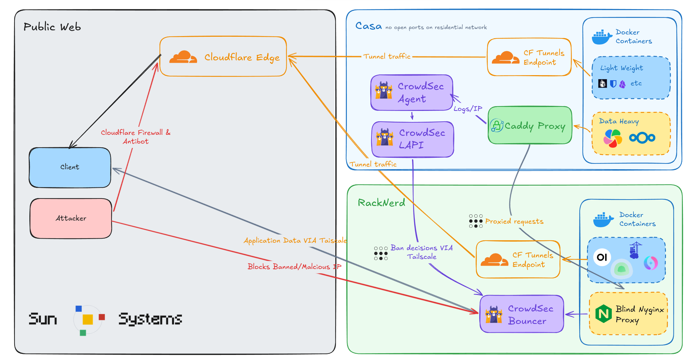

## Server Evolution Timeline

1. **2022 - Foundation**: Linux and Nextcloud, outgrowing Google Drive.
2. **2024 - Expansion**: Immich, Vaultwarden, Memos, and more.
3. **2025 - The AI Wave**: OpenWebUI Agentic Tooling and the Autonomous AI Router.
4. **2026 - Hardware & Agents**: CockpitAgent and Vigyl, the server management dashboard.

- **Vigyl**: https://github.com/Peteryhs/Vigyl
- **CockpitAgent**: https://github.com/ShaoRou459/CockpitAgent
- **OpenWebUI Agentic Tooling Suite**: https://github.com/ShaoRou459/OpenWebUI-Agentic-Tooling

## Server Networking Setup

Information partially gathered by Cockpit Agent