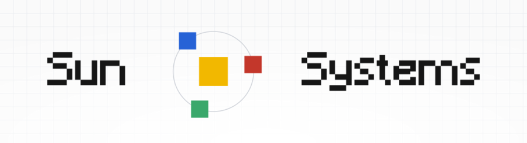

Hybrid self hosted home lab, temp name, Sun Systems

Sun Systems is a hybrid homelab server fleet running selfhosted services that I use. It is built to liberate those around me and myself from constraints on cloud hosted services, while ensuring our data are private and safe (to a higher degree, anyways). 

The below is a detailed overview of my progress on the server and its design for the past 4 years.

*All Specs Will be Updated as They Change*

**Sections**: [#1. Overall Architecture](#1-overall-architecture) · [#2. Functionality](#2-functionality) · [#3. Network & Security](#3-network--security) · [#4. Storage & Redundancy](#4-storage--redundancy) · [#5. Future Plans](#5-future-plans) · [#6. Summary and Reference](#6-summary-and-reference)

## 1. Overall Architecture

Sun Systems is two clusters of compute working together: a home origin server and a public gateway VPS.

### Compute

- **Casa** (home): a repaired HP ENVY laptop, Intel i5 10th gen, 8 GB RAM, 128 GB SSD + 1 TB HDD. Runs physically at my house.
- **Racknerd** (cloud): a remote VPS from Racknerd, 2-core AMD CPU, 2.5 GB RAM, 40 GB SSD.

### External Storage

- **12 TB Seagate Ultrastar HDD**: connected to Casa via a USB-A bridge through its enclosure. Serving as the main storage tier.

### Platform

- Both servers run Linux, Casa on Zorin OS 17, Racknerd on Ubuntu.
- Both run self-hosted software in Docker. 
	- Casa runs compute heavy services (like Immich with its ML features).
	- Racknerd takes the lighter ones and also acting as Casa's public gateway via a blind proxy. That keeps ports off the residential network and bypasses Cloudflare's 100 MB transfer limit.
- Both run Cockpit for remote server monitoring and management.

### Evolution / Change Log

From its initial form as a lone computer by my desk in 2022, it has picked up several upgrades:

1. **2022**
   - Started as a lone computer by my desk.
1. **2024**
   - Added the VPS.
3. **2024**
   - Upgraded to better residential fibre internet.
4. **2025**
   - Added the 12 TB storage expansion.
5. **2026**
   - Set up the blind proxy through Racknerd.
   - Refreshed the container management system.

## 2. Functionality

Sun Systems focuses on hosting open-source alternatives to everyday utilities, including Google Drive/Photos, password managers, AI chatbots, and notes apps. 

These services mainly serve my family and friends, and myself, of course. 

Compose files for the dockerized services are located in a central folder under /home. 
### Hosted Services

Each entry shows where it runs and who built it:

 = on Casa (home server) ·  = on Racknerd VPS
 = built in-house ·  = third-party OSS
 = Docker container ·  = system-wide service ·  = other

- **[Nextcloud](https://github.com/nextcloud/server)**   
	- My choice of alternative to G-Suite: files, cloud notes, and office editing
	- The AIO packaged version of Nextcloud is run.
	- Containers: apache, database, redis, imaginary, collabora, notify-push, talk, whiteboard, mastercontainer
- **[Immich](https://github.com/immich-app/immich)**   
	- Alternative to Google Photos: photo & video library with ML-powered classification and search + much more!
	- Containers: machine-learning, postgres, redis/valkey
- **[Memos](https://github.com/usememos/memos)**   
	- My choice of note app: lightweight note-taking, simple and adaptable. 
	- Runs as a single container.
- **[Vaultwarden](https://github.com/dani-garcia/vaultwarden)**   
	- Alternative to Bitwarden: password manager, works with the official Bitwarden apps, but in rust so lighter. 
	- Runs as a single container.
- **[Obsidian LiveSync](https://github.com/vrtmrz/obsidian-livesync)**   
	- Self hosted Obsidian Sync: syncs my Obsidian notes across devices
	- Backed by a CouchDB database container.
	- Containers: CouchDB
- **[Open WebUI](https://github.com/open-webui/open-webui)**   
	- Alternative to ChatGPT: self-hosted AI chat/agent interface
	- Runs as a single container, with models routed through New API.
- **[New API](https://github.com/QuantumNous/new-api)**   
	- Aggregator for different LLM APIs: API keys, model routing, and usage tracking for the AI services
	- Runs as a single container.
- **[Uptime Kuma](https://github.com/louislam/uptime-kuma)**   
	- Uptime monitoring and status pages, also used in Vigyl for alert for status updates
	- Runs as a single container.
- **[Vigyl](https://github.com/Peteryhs/Vigyl)**   
	- My own live status display: the LCD at Casa showing CPU, RAM, and container online state
	- The display hardware sits beside Casa on a microcontroller.
- **[Memos MCP](https://github.com/ShaoRou459/memos-mcp)**   
	- MCP server: gives AI agents read/write access to my Memos db. 
	- Runs as a single container.
- **[CockpitAgent](https://github.com/ShaoRou459/CockpitAgent)**   
	- AI Agent that lives in Cockpit to perform server management tasks.
	- Runs as a Cockpit plugin. 

### Backend Containers

The server fleet also hosts its own system and maintenance software:

- **[Watchtower](https://github.com/containrrr/watchtower)**   
	- Keeps all Docker images updated automatically
	- Runs as a single container.
- **[Cockpit](https://github.com/cockpit-project/cockpit)**   
	- Web console for server monitoring and management, hosts Cockpit Agent
	- Runs as a system service.
- **[CrowdSec Agent](https://github.com/crowdsecurity/crowdsec)**   
	- IP based threat detection that feeds decisions to the edge bouncer
	- Runs as a system service.
- **[CrowdSec Bouncer](https://github.com/crowdsecurity/crowdsec)**   
	- Blocks banned IPs in nftables at the internet edge
	- Runs as a system service.
- **[Cloudflared](https://github.com/cloudflare/cloudflared)**   
	- Cloudflare Tunnel keeping Casa reachable without open ports
	- Runs as a system service.
- **[Cloudflared](https://github.com/cloudflare/cloudflared)**   
	- Same thing as above but for services on the VPS. 
	- Runs as a container.
- **[Caddy](https://github.com/caddyserver/caddy)**   
	- TLS reverse proxy in front of the services
	- Runs as a system service.
- **[Portainer](https://github.com/portainer/portainer)**   
	- Container management UI for both nodes
	- Runs as a container.
- **[Portainer Agent](https://github.com/portainer/portainer)**   
	- Connects Casa's containers to the Portainer UI on VPS. 
	- Runs as a container.
- **[open-terminal](https://github.com/open-webui/open-terminal)**   
	- Open WebUI's terminal tool: sandboxed files, shell, and code execution for the AI
	- Runs as a container.
- **Blind proxy**   
	- My own custom nginx stream proxy carrying 80/443 over Tailscale to Casa
	- Runs as a container on the VPS.

By utilizing all of the hardware available in the stack, storage focused solutions like NC and immich has virtually unlimited storage for our usage, making them far superior compared to their cloud alternatives. 

We also get to find and use unique FOSS projects like Memos and Obsidian Live sync, which provides much more choice and flexibility in our workflow. They are also highly customizable such that I can make MCP servers for them.

Now, onto how everything works. 
## 3. Network & Security

This section covers how the services in the stack talk to each other, and how they reach the internet. 

Topology diagram:

*orange = Cloudflare tunnels · purple = CrowdSec · red = blocked threats · grey = Tailscale overlay*

### The three pathways

There are 3 paths for services to reach the internet. 

**Cloudflare Tunnels on Casa :** lightweight services that mostly move plain text, like the notes containers (Memos, Obsidian LiveSync), are exposed straight from the origin through Cloudflare tunnels. Deployment is simple: point a domain at a local port and the service is up. Maintenance is easier too, since my domains live on Cloudflare anyway. 

Cloudflare also handles the boring stuff, like certificate renewals, and throws in antibot and analytics on the free plan. It also provides more advanced tools like Cloudflare Access, which protects the VaultWarden admin panel, so even if the master password is breached it still requires an email verification to tempter with the setup. 

There is one catch: Cloudflare caps transfers at 100 MB. That is a huge problem for Nextcloud and Immich, which send and receive huge files. 

**VPS Blind Proxy Gateway w/ CrowdSec :** the heavy services take a different road. Inbound traffic goes straight through the custom built Layer 4 blind proxy on the VPS (We have Cloudflare point our domains to the VPS's IP), which forwards it to Caddy on Casa over Tailscale. This bypasses the CF tunnel limits, as the VPS has huge bandwidths with minimal network restrictions.  

This proxy also does TLS passthrough, so the connection stays encrypted end to end. Since TLS only ends at Caddy on Casa, even the VPS provider cannot read the traffic. Only Casa sees the data. 

We also use CrowdSec to protect this path. The CrowdSec agent on Casa watches for malicious activity in Caddy's logs. The CrowdSec bouncer on the VPS blocks known malicious IPs, plus any the agent detects (also transfered via the Tailnet), before they reach the blind proxy. 

So the services holding our precious data and memories stay safe, without Cloudflare. 

**Cloudflare Tunnels on VPS :** similar story to Casa. The VPS only hosts lightweight services, and they are all exposed directly on the Cloudflare edge through tunnels. 

## 4. Storage & Redundancy

The server stack has an abundance of different storage mediums, totaling ~13TB. 

Although it currently uses a rather rudimentary backup system using Borg Backup, a full revamp to RAID-Z is on the horizon (ETA Q4 2026). 

Disk Layouts:

| Device                                        | Size   | Type | Use         | Role                                         |
| :-------------------------------------------- | :----- | :--- | :---------- | :------------------------------------------- |
| Seagate Ultrastar  | 10.9 T | ext4 | 3% (295G)   | **Hosts live data** (Immich, Nextcloud data) |
| WD HDD             | 931 G  | ext4 | 30% (256G)  | **Local backup** (borg/Vorta repos)          |
| SanDisk SSD        | 119 G  | ext4 | 75% (82G)   | OS + Docker + app configs                    |
| KVM SSD Storage     | 40 G   | ext4 | 73% (29.2G) | Hosts system + Application Data              |

Backup Solution:

Data hosted on Casa are backed up periodically via Borg backup. Below are their respective schedules and targets:

Nextcloud:
- Interval: Every 4 Weeks
- Origin: The Nextcloud data dir located on the Seagate HDD
- Target: Repo on the WD HDD

Immich:
- Interval: Every 4 Weeks
- Origin: The Immich data dir on the Seagate HDD 
- Target: Repo on the WD HDD

Vaultwarden:
- Interval: Daily
- Origin: The Vaultwarden data dir on the SSD
- Target: Encrypted repo on the WD HDD

**Current problems:**

- Both copies live in the same machine. Live data sits on the Seagate HDD, and all borg repos sit on the WD HDD inside the same box. Fire, theft, or a dead PSU takes both at once. RAID-Z fixes a dead drive, not a dead machine, and there is no offsite copy yet, so a whole-box loss still means total data loss.
- A restore has never been tested. Borg validation only checks that archives exist. The first real restore will be the true proof, and it has not happened yet as there has not been a hardware failure (though testing should have been conducted). 
- Only the Vaultwarden repo is encrypted. The Immich and Nextcloud repos are plaintext. If the backups were ever compromised, they can be read and the data stored could be read (though the services themselves doesn't store data encrypted anyways so that is less of a concern). 

**What is not backed up:**

- The OS and app configs on the SSD: docker compose files, Caddy, CrowdSec, and the OS itself have no borg profile. A dead SSD means rebuilding the whole stack from scratch.
- Memos data. The notes database is not in any repo. It is the most irreplaceable data in the stack.
- The Obsidian LiveSync database (CouchDB). The sync hub has no backup. The vault itself lives on other devices, so the notes are partially protected, but the hub is not.

## 5. Future Plans

Since its start in 2022, the server has gone through many iterations to reach its current stage. From the initial struggles of finding the right OS, to failing to correctly customize my compose files, and partitioning mistakes that caused me to scrap entire setups, I have learned a lot from building this system.

The current fifth version of the system has been operating stably since 2024, and has become increasingly something I use every day, as most problems directly affecting its effectiveness have been ironed out.

Obviously, as highlighted in the redundancy section, the system is nowhere close to being stable and truly safe, and therefore this section will highlight what happens from now on, starting with better data protection in late 2026.

### Q4 2026

- [ ] Better refinement of the current backup process & verify backups can be restored easily
- [ ] Better research and preparation of the plan for a RAID-Z architecture for the server stack
- [ ] Better detail software maintenance plans for the server on the GitHub repo

### Q1 2027

- [ ] Proper backup of all user data
- [ ] Implementation of RAID-Z and ensuring the transfer of user data

### Q2 2027 and onwards

- [ ] Better directory management, including data folders for services and config files (e.g. compose files)
- [ ] More fleshed out and complete hardware maintenance (cleaning of fans, thermal paste etc.)

...

These are what will happen to the server in the foreseeable future. As the world of technology continues to evolve, I am sure there will be many more changes to the stack that aren't currently documented. Please refer back to this document as it updates.

## 6. Summary and Reference

### Glossary

A quick map of the terms used in this document.

- **Casa**: the home origin server (an HP ENVY laptop). The data of every service lives here.
- **Racknerd (rn225)**: the public VPS. It is the internet-facing entry point, or edge, of the stack.
- **Origin and edge**: the origin holds the data (Casa); the edge meets the internet (Racknerd). A request arrives at the edge and travels to the origin.
- **Blind proxy**: my name for a Layer 4 TCP stream reverse proxy with TLS passthrough. It forwards raw connections to Casa over Tailscale and never looks at the contents.
- **Layer 4**: the transport layer of networking (TCP/UDP). A Layer 4 proxy works on connections, not on the web requests inside them.
- **TLS passthrough**: when the proxy does not end the encryption, but forwards the encrypted connection to the origin as-is. The proxy cannot read the traffic.
- **Terminate TLS**: the point where the encryption is decrypted. It only happens at Caddy on Casa, so the data is readable nowhere else.
- **Cloudflare Tunnel (cloudflared)**: an outbound-only connection from a server to the Cloudflare edge. It keeps the server reachable without opening any ports.
- **Tailscale (Tailnet)**: a private, encrypted overlay network. Casa and Racknerd join it so they can reach each other through NAT with nothing exposed to the internet.
- **Caddy**: the reverse proxy on Casa. It terminates TLS and routes traffic to the correct service.
- **PROXY protocol**: a small header the blind proxy adds so Caddy learns the real client IP after the connection crossed the proxy.
- **CrowdSec**: an IP-based threat detection engine. The agent on Casa watches logs for malicious IPs; the bouncer on Racknerd blocks them at the firewall.
- **nftables**: the Linux firewall where the bouncer writes its IP bans.
- **Docker / systemd**: the two ways software runs here. Docker runs containers; systemd runs native OS services.
- **Borg / Vorta**: Borg is the backup engine that stores deduplicated archives; Vorta is the GUI that schedules and runs them.

The three traffic routes, and their logos:

- **VPS blind proxy gateway** : the direct road for heavy services 
- **Cloudflare tunnel to Casa** : the road for lightweight Casa services 
- **Cloudflare tunnel to VPS** : the road for lightweight VPS services

### Service Summary

| Service            |             On              |              Built               |         Runs as         | Backed up | Traffic path                                             |
| :----------------- | :-------------------------: | :------------------------------: | :---------------------: | :-------: | :------------------------------------------------------- |
| Nextcloud          |  |  |   |    Yes    |  Blind proxy                      |
| Immich             |  |  |   |    Yes    |  Blind proxy                      |
| Memos              |  |  |   |    No     |  CF tunnel to Casa                |
| Vaultwarden        |  |  |   |    Yes    |  CF tunnel to Casa, behind Access |
| Obsidian LiveSync  |  |  |   |    No     |  CF tunnel to Casa                |
| Vigyl              |  |     |    |    No     | Local (LCD display)                                      |
| Open WebUI         |   |  |   |    No     |  CF tunnel to VPS                 |
| New API            |   |  |   |    No     |  CF tunnel to VPS                 |
| Uptime Kuma        |   |  |   |    No     |  CF tunnel to VPS                 |
| Memos MCP          |   |     |   |    No     | Internal (Tailscale to Casa)                             |
| CockpitAgent       |   |     |    |    No     | Local (Cockpit plugin)                                   |
| Watchtower         |  |  |   |    No     | Local (image updates)                                    |
| Cockpit            |  |  |  |    No     | Local (management)                                       |
| CrowdSec agent     |  |  |  |    No     | Local (reads Caddy logs)                                 |
| CrowdSec bouncer   |   |  |  |    No     | Internal (Tailscale to LAPI)                             |
| Caddy              |  |  |  |    No     | Local (origin proxy)                                     |
| Cloudflared (Casa) |  |  |  |    No     |  Outbound to Cloudflare           |
| Cloudflared (VPS)  |   |  |   |    No     |  Outbound to Cloudflare           |
| Blind proxy        |   |     |   |    No     |  The blind proxy route            |
| Portainer          |   |  |   |    No     |  CF tunnel to VPS                 |
| Portainer Agent    |  |  |   |    No     | Internal (Tailscale to Portainer)                        |
| open-terminal      |  |  |   |    No     | Internal (Tailscale from Open WebUI)                     |

## Acknowledgments

The logos in the diagrams belong to their respective owners:

- Cloudflare
- CrowdSec
- Docker
- Caddy
- NGINX
- Tailscale
- Portainer
- Immich
- Nextcloud
- Memos
- Vaultwarden (Bitwarden)
- Obsidian
- Open WebUI
- plus the smaller app icons inside the container boxes, owned by their projects

All product names and logos are trademarks of their respective owners.

The layout icons (server, VPS, routes, badges) come from the Lucide open source icon set. The Sun Systems mark is an original design.
